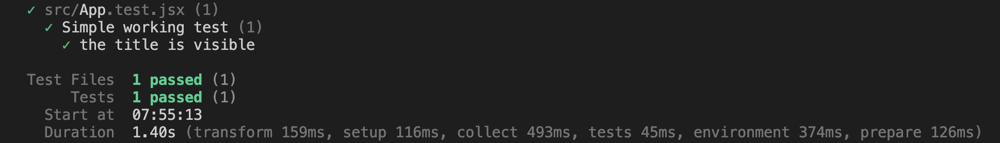

# My Photo Album React App

This is a web application that allows users to find and assemble a collection of stock image photographs into an album in a fast and intuitive way.

## To Run Local Build
`npm run dev`

## Key Functionality
- [x] Display gallery of stock photos from the Sling Academy API.
- [x] Drag and drop stock images from the grid into your album.
- [x] Display a textual label for each image selected.
- [x] Allow users to remove images from their album in an intuitive way.
- [x] Make the interface responsive to mobile views.
- [x] Implement semantic structures and metadata designed to maximize SEO.

## Enhancements
- [x] Image is visually muted when it has already been added to the album.
- [x] Indicate empty/loading/error states.
- [x] Customize your page with light/dark theme options.
- [x] The App was deployed to Netlify.
- [x] Implemented unit tests using React Testing Library to verify user interactions.

## Implementations Details
- `React-infinite-scroll-component` was used to implement infinite scrolling, which provides a seamless and user-friendly experience for loading large amounts of data and improve app performance.
- `React Query` was used to efficiently manage API requests and data fetching, which improved the performance of the application.
- `TailwindCSS` was used to rapidly build and customize responsive UI components, which provided ready-made CSS classes for styling and layout, allowing for faster development compared to writing custom CSS.
- `React Icons` was used to incorporate icons for changing themes, which enhanced the user interface and made it more visually appealing.
- `React Hooks` were used to manage state, perform side effects, and access global context, which simplified the codebase and made it more maintainable.
- - `useState`
- - `useEffect`
- - `useContext` 
- - `useReducer`
- The `react-use` library was utilized for its collection of reusable React hooks, providing capabilities like device detection.
- The `react-dnd` package along with `react-dnd-html5-backend` and `react-dnd-touch-backend` were implemented to enable drag and drop functionality.

## SEO Optimization
- Semantic HTML and appropriate heading tags were used to help search engines understand the organization of the content.
- Image optimization: added `alt` attributes for all images to provide context to search engines about the content of the images.
- Include a `<title>` that accurately describes the page content.
- Include relevant meta tags such as viewport, description, and keywords in the `<head>` section of the HTML document. 
- Mobile friendly.

## Verification Plan
- [x] Verify that the screen is populated with 100 images from the specified API.
- [x] Verify that users can add one or multiple images to the album by dragging and dropping them onto the page.
- [x] Ensure that the image's opacity alters upon addition to the album.
- [x] Verify that users can remove images from their album.
- [x] Verify that the interface is responsive to mobile views.
